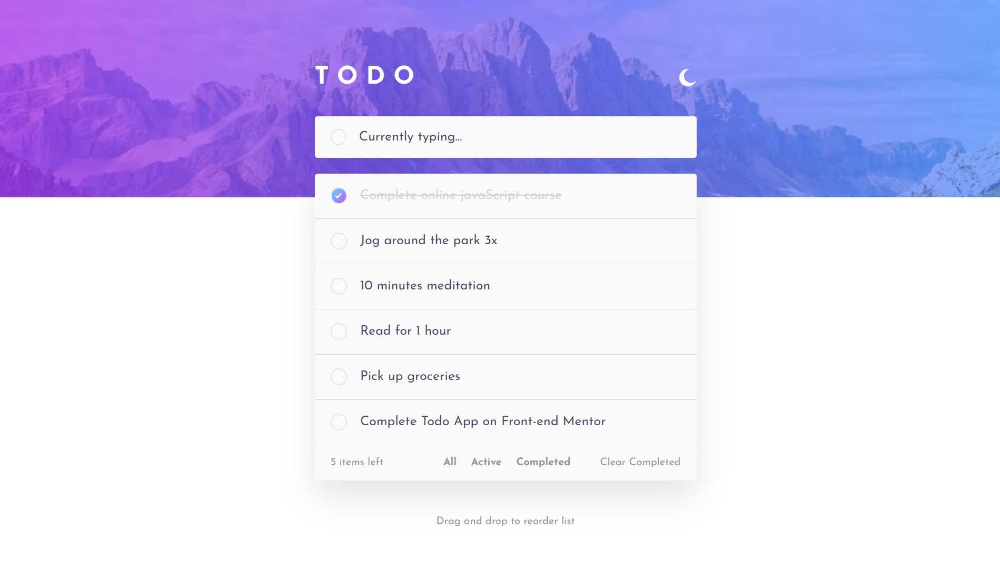
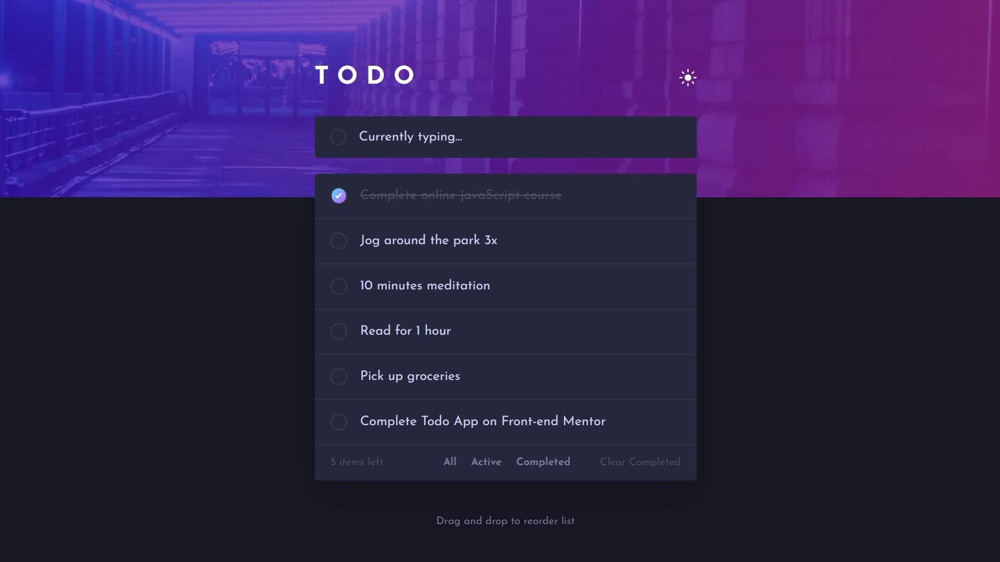
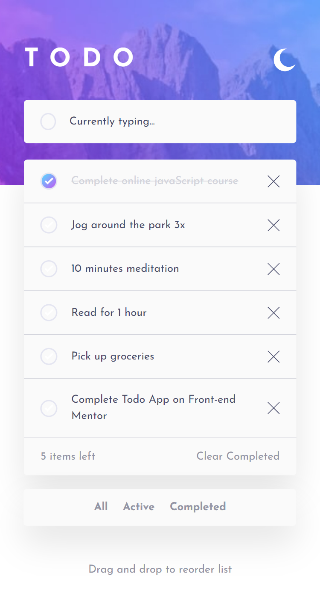
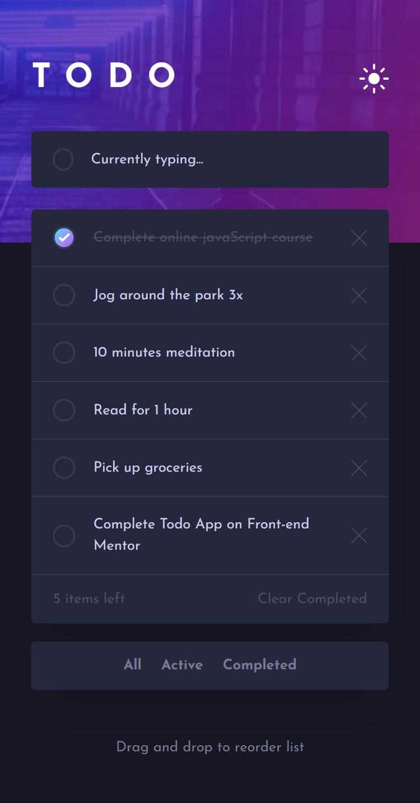

# Frontend Mentor - Todo app solution

This is a solution to the [Todo app challenge on Frontend Mentor](https://www.frontendmentor.io/challenges/todo-app-Su1_KokOW).

## Table of contents

- [Overview](#overview)
  - [The challenge](#the-challenge)
  - [Screenshot](#screenshot)
  - [Links](#links)
- [My process](#my-process)
  - [Built with](#built-with)
  - [What I learned](#what-i-learned)
  - [Continued development](#continued-development)
  - [Useful resources](#useful-resources)
- [Author](#author)

## Overview

### The challenge

Users should be able to:

- View the optimal layout for the app depending on their device's screen size
- See hover states for all interactive elements on the page
- Add new todos to the list
- Mark todos as complete
- Delete todos from the list
- Filter by all/active/complete todos
- Clear all completed todos
- Toggle light and dark mode
- Drag and drop to reorder items on the list

### Screenshot






### Links

- Solution URL: [https://www.frontendmentor.io/solutions/responsive-todo-app-using-sass-and-modular-javascript](https://www.frontendmentor.io/solutions/responsive-todo-app-using-sass-and-modular-javascript-HiKwpOo-qh)

- Live Site URL: [https://todo-app-tasks-manager.netlify.app/](https://todo-app-tasks-manager.netlify.app/)

## My process

### Built with

- Semantic HTML5 markup
- CSS custom properties
- Flexbox
- CSS Grid
- SASS
- JavaScript

### What I learned

Adding border with gradient and radius:

```css
.task:hover .check-box {
  border-radius: 50px;
  border: 2px solid transparent;
  background: var(--bg-gradient) border-box;
  -webkit-mask: linear-gradient(var(--Very-Light-Gray) 0 0) padding-box, linear-gradient(
      var(--Very-Light-Gray) 0 0
    );
  -webkit-mask-composite: xor;
  mask-composite: exclude;
}
```

Adjust background-image to stretch but not shrink:

```css
.app {
  background-repeat: no-repeat;
  background-size: 100% 30rem;
}
@media (max-width: 1440px) {
  .app {
    background-size: auto 30rem;
    background-position-x: center;
  }
}
```

Swap items in an array using array destructuring

```js
[this.tasksArr[draggedElIndex], this.tasksArr[targetElIndex]] = [
  this.tasksArr[targetElIndex],
  this.tasksArr[draggedElIndex],
];
```

### Continued development

- I guess the CSS implementation of dark mode need to be refactored.
- The application should have a reset button to remove data in local storage.

### Useful resources

- [DEV Community](https://dev.to/afif/border-with-gradient-and-radius-387f) - This helped me figure out how to implement the gradient circular border.

## Author

- Frontend Mentor - [@nabdelfattah](https://www.frontendmentor.io/profile/nabdelfattah)
- GitHub - [nabdelfattah](https://github.com/nabdelfattah)
- Linked-in - [Nadda W. Abdelfattah](https://www.linkedin.com/in/nadda-w-abdelfattah/)
